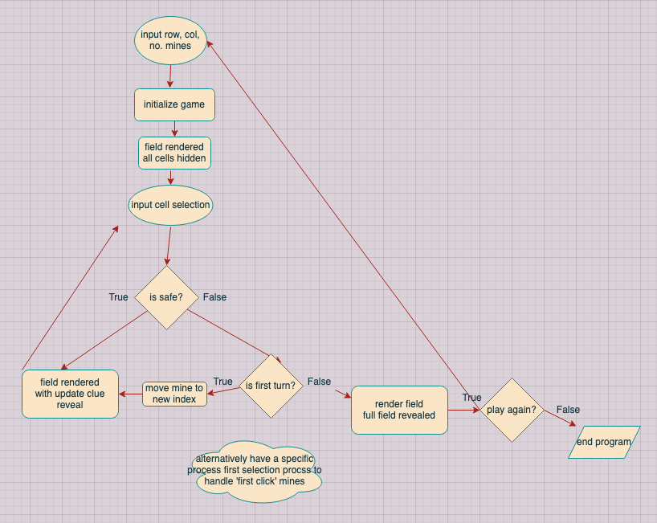
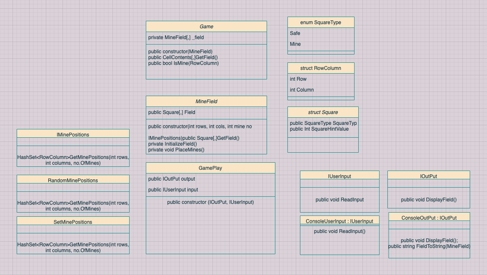

# MineSweeper

## Planning and Design (WIP) :)
#### DataFlow Diagram(WIP)

Really this is just for planning the game flow which is low on my priority list but worth running through because I never played mine sweeper when i was younger so I needed to clarify what my game progression might look like.



#### Class Diagram (WIP)

I began a class diagram before I started work on MineSweeper but kept it very basic, restricted to what I knew I would implement first off.

 I have added to it and changed it each day as I make decisions as particular problems and solutions present themselves. 

For instance today (17/11/20) I pulled off my minefield into a seperate class while working on my 'HintCalculation' card. 





#### TDD

I rely heavily on my unit tests to know that something I'm implementing or changing is working. 

I won't be running my program until I need to implement console gameplay - that is, I aim to be particularly strict and confident I can depend upon my unit tests. Long live hello world.

```C#
using System;

namespace MineSweeper
{
    class Program
    {
        static void Main(string[] args)
        {
            Console.WriteLine("Hello World!");
        }
    }
}

```

#### Dependency Injection

I have strived to implement dependency injection design patterns in my class structure for this kata. There are a few sites I hope to adhere to this pattern but one instance early on in building MineSweeper is my MineField class. The minefield and its associated initilization do not relate to the game play or rules itself, so today, after writing initial logic for my game-ready field initilization I pulled off everything into a seperate MineField class. 

This has a few benefits I can see

- It's open to modification: I am free to change around the MineField class it as I please without interupting anything I may work on in the Game class or elsewhere.
- everything is more testable: my game class's tests aren't bogged down by field initilization tests, and furthermore everythin else in my game class I may want to test isn't dependent on too many other functions in my game class, I just need to pass in a field. It's easier to pinpoint any problems when things are split up this way.

#### YAGNI

This will continue to be a theme and one I struggle most being strict with. As someone who is learning and has a powerful imagination and therefore often pretty excited when I'm working. Sometimes when the ball is rolling I can end up adding in lots of extra details. My mentors Frank and Bianca have, when we dicsussed this, given me good alternatives - for instance adding a trello card or plopping it down somewhere else. 

I knew when I showed some changes that I would be pulled up on the below bool properties on this newly added struct.
I needed my new Square struct, but I didn't need those bools, but they belongd there so I put them in because I couldn't help it. But I removed them straight away when I started showing my work and it came up in conversation - I appreciate why this rule exists. These bools look innocent enough but sometimes (and more usually for me) it's something bigger that runs away with you. That's why I'm being more stringent on this one this time round and have asked my mentors to keep a tight rein here.

```C#
namespace MineSweeper
{
    public struct Square
    {
      public SquareType SquareType;
      public int SquareHintValue;
      public bool Flagged; // <=== offending property
      public bool Revealed;// <=== offending property
        
    }
}
```

Error Handling

```C#
   [Fact]
    public void WillThrowArgumentExceptionIfNumberOfMineArgumentExceedsTheRowColumnArguments()
    {
      var minePositions = new RandomMinePositions();
      var ex = Assert.Throws<System.ArgumentException>(() => minePositions.GetMinePositions(3, 3, 10));

      Assert.Equal("numberOfMines exceeds array dimensions (Parameter '10')", ex.Message);

    }
```

```C#
 public HashSet<RowColumn> GetMinePositions(int rowDimension, int columnDimension, int numberOfMines)
    {
      if (numberOfMines > (rowDimension * columnDimension))
      {
        throw new System.ArgumentException("numberOfMines exceeds array dimensions", $"{numberOfMines}");
      }
      var rnd = new Random();
      HashSet<RowColumn> minesPositions = new HashSet<RowColumn>();

      for (int i = 0; i < numberOfMines;)
      {
        int rndRow = rnd.Next(0, rowDimension);
        int rndCol = rnd.Next(0, columnDimension);
        var mineLocation = new RowColumn(rndRow, rndCol);
        if (!minesPositions.Contains(mineLocation))
        {
          minesPositions.Add(mineLocation);
          i++;
        }
      }
      return minesPositions;
    }
```

#### Clear Intent


```C#
using System.Collections.Generic;

namespace MineSweeper
{
  //this class isn't clear and has confused behaviour. arbitrary arguments for its implementation of getminepositions member
  public class SetMinePositions : IMinePositions
  {
  public HashSet<RowColumn> setListOfMines;
    public SetMinePositions(HashSet<RowColumn> hashSetOfMines)
    {
      setListOfMines = hashSetOfMines;
    }
    public HashSet<RowColumn> GetMinePositions(int rowDimension, int columnDimension, int numberOfMines)
    {

      return setListOfMines;
    }
  }
}
```

```C#
using System.Collections.Generic;

namespace MineSweeper
{
    public interface IMinePositions
    {
        HashSet<RowColumn> GetMinePositions(int rowDimension, int columnDimension, int numberOfMines); 
    }
}
```

OOP/ Design and Decision making. Where should some data belong?

Who is responsible for if the square is revealed?

As things stand my square is a class with a hintvalue and a square type, it had a bool on it 'revealed. 

- when i decide to reveal clues and print the boadr is it faster/better to look into the board, look into it's square obj and ask are you revealed?
  or 

- have the game know which squares it has revealed as a hashset of rowcolumn indexes and when it looks through the field go, is this one on my list?

  
probably 'efficiency' isn't going to be what a decision comes down to because there is likely little difference. 
  What is more meaningful is  how my class and program read as a whole. 
  
  I feel like seperaet list to decide what is and isn't revealed is maybe less OOP but more domain appropriate.
  
  Either way has implications for other logic.
  
  for instance to implement the 'can't lose on first hit' logic I will need to reassign a mine somewhere else on the field. with a square class, I change it's enum property, and then I wil have to recalculate its adjacent squareHintValues.
  
  On the other hand if I return to the square struct I would new up a new square object and put it in.  and have to instantiaet new squares and insert them for the adjacent squres - this is based on my understanding of using a struct well or appropriately - to properly benefit from its value type it is idea if they are immutable. 
  
  One attractive thing about the square class as it stands is I probably do wanta mutable object. I don't want to throw the whole game away because someone hit a mine / new it up again when the same thing could happen/ expensive resource wise - so I can manipulate the square (have the squaer type as something mutable / designed that way) or a struct and make new ones and put them in. 
  
- the struct might be preferable in the end because it's only in the instance that the first hit is a mine that I have reason to change anything about the squares (UNLESS I want the square to be responsible for if it is revealed as well)

```c#
  public string FieldAsString()
    {
      var printableField = new StringBuilder();

      for (int i = 0; i < _field.RowDimension; i++)
      {
        for (int j = 0; j < _field.ColumnDimension; j++)
        {

          var squareSymbol = _revealed.Contains(new RowColumn(i,j)) ? (SquareAsString(_field.Field[i, j])) : (" ");

          // var squareSymbol = _field.Field[i, j].Revealed ? (SquareAsString(_field.Field[i, j])) : (" ");

          printableField.Append(squareSymbol);

        }
        printableField.Append("\n");
      }
      return printableField.ToString();
    }
```

